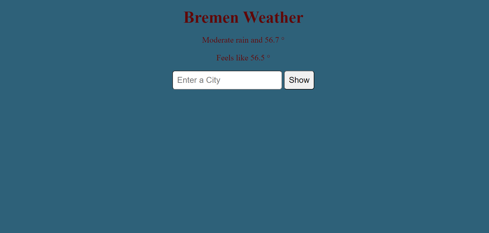
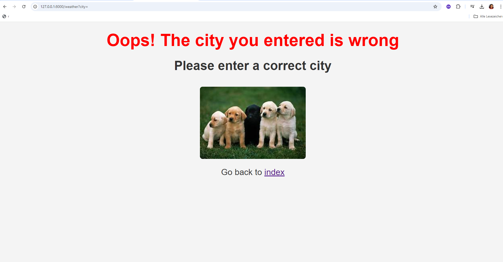

# Flask Weather App

## Project Overview
This is a simple Flask web application that allows users to input a random city name and fetches the current weather for that city using an external weather API. If the user inputs an invalid or incorrect city name, the app notifies the user to input a correct city name.

## Features
- Input a city name to get real-time weather data, including temperature and weather conditions.
- If the city name is invalid or not found, the app displays a message asking the user to input a valid city.
- The weather data is fetched from an external weather API.

## Demo
Here's how the application works:

1. User enters the name of a city in the input field.
2. If the city is valid, the app displays the current weather, including:
   - Temperature
   - Weather condition (e.g., clear, cloudy, rain)
   - Feels like temperature
3. If the city is not found, the app displays an error message asking the user to input a correct city.

## Screenshots
**Weather Display Example**



**Error Example**



## Technologies Used
- **Flask**: A lightweight web framework for Python.
- **HTML/CSS**: For front-end rendering.
- **OpenWeatherMap API**: For fetching the real-time weather data.
- **Python**: Backend language for API integration and server logic.

## Getting Started

### Prerequisites
Before you can run the project, ensure you have the following installed:

- **Python 3.x**: The project is built using Python.
- **Git**: To clone the repository.
- **Flask**: To run the web server.

## Project Structure
Here is a basic breakdown of the project files:

```
flask-weather-app/
│
├── static/              # Static files (CSS, JS, Images)
├── templates/           # HTML templates
│   ├── index.html     # Main weather display page
│   └── error.html  # Error page for invalid city input
├── app.py               # Main Flask app
├── .env                 # API Key storage
├── requirements.txt     # List of dependencies
└── README.md            # Project documentation
```

## Dependencies

The project depends on the following Python packages, which are listed in `requirements.txt`:

- **Flask**: Web framework.
- **Requests**: For making HTTP requests to the OpenWeatherMap API.
- **python-dotenv**: For loading environment variables from a `.env` file.


### Setup Instructions

1. **Clone the Repository**
   Start by cloning this repository to your local machine:

   ```bash
   git clone https://github.com/yourusername/flask-weather-app.git
   ```

2. **Navigate to the Project Directory**

   ```bash
   cd flask-weather-app
   ```

3. **Set Up a Virtual Environment** (Recommended)
   It's a good practice to use a virtual environment to manage project dependencies:

   ```bash
   python -m venv venv
   source venv/bin/activate  # On Windows: venv\Scripts\activate
   ```

4. **Install the Dependencies**

   ```bash
   pip install -r requirements.txt
   ```

   Make sure you have Flask and other necessary packages installed.

5. **Set Up Your API Key**
   - The app uses the **OpenWeatherMap API**. You need to create an account and get an API key from [OpenWeatherMap](https://home.openweathermap.org/users/sign_up).
   - Create a `.env` file in the project root and add your API key like this:

     ```
     API_KEY=your_openweathermap_api_key
     ```

6. **Run the Flask Application**

   ```bash
   python app.py
   ```

   By default, the app will be available at `http://127.0.0.1:5000/`.

### Usage
1. Go to `http://127.0.0.1:5000/`.
2. Enter the name of a city in the input field and click **Submit**.
3. The weather data for the city will be displayed if the city is valid.
4. If the city name is incorrect, an error message will be shown asking for a valid city.

### Example Cities
- **Valid City**: Try inputting city names like `London`, `Paris`, or `New York`.
- **Invalid City**: Input something like `RandomCity123` to see the error message.

## Error Handling
If the city entered by the user is invalid (not recognized by the API), the app will display an error page with the message:
```
Oops! The city you entered is wrong. Please enter a correct city.
```
